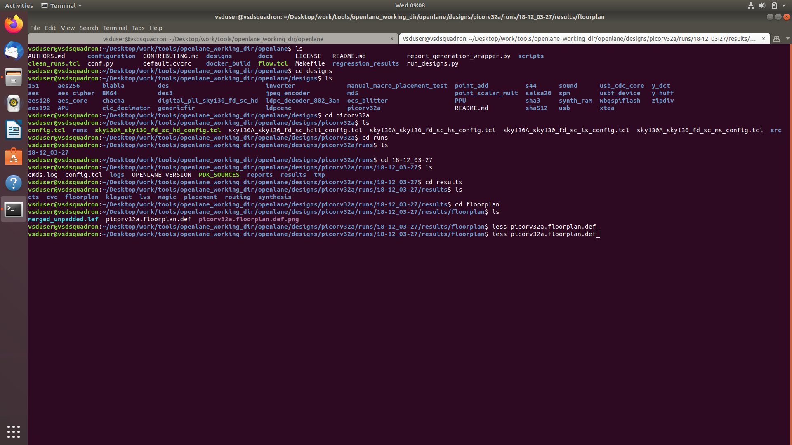
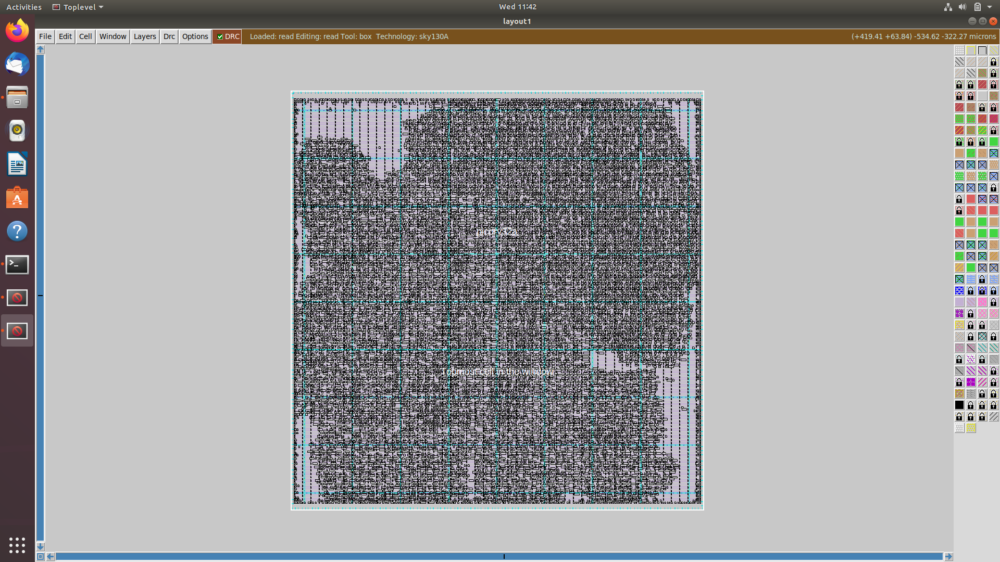
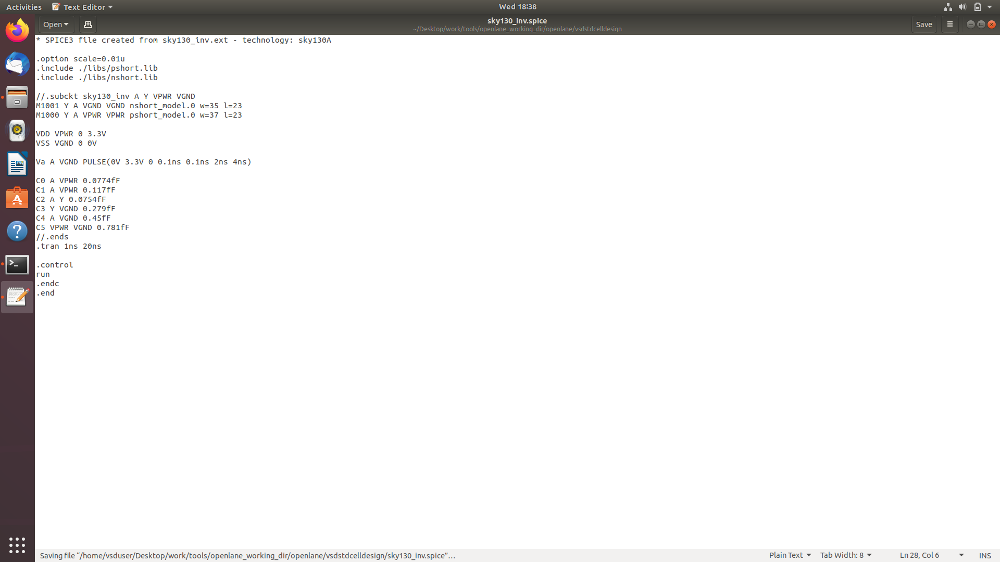
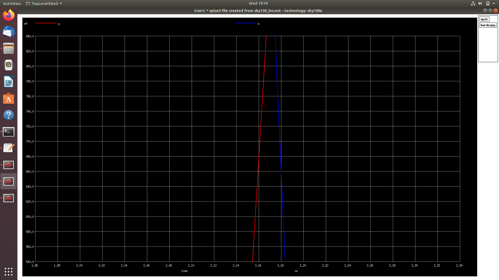
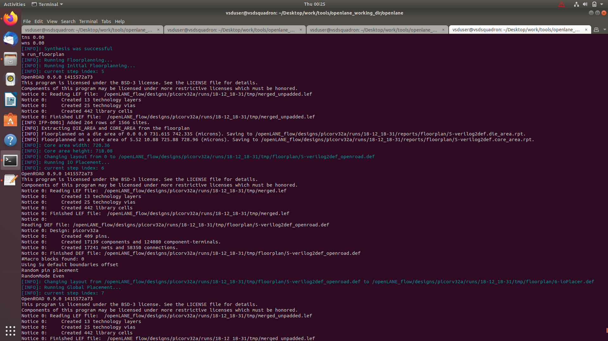
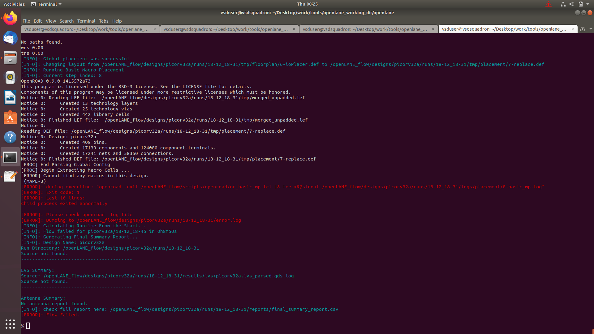
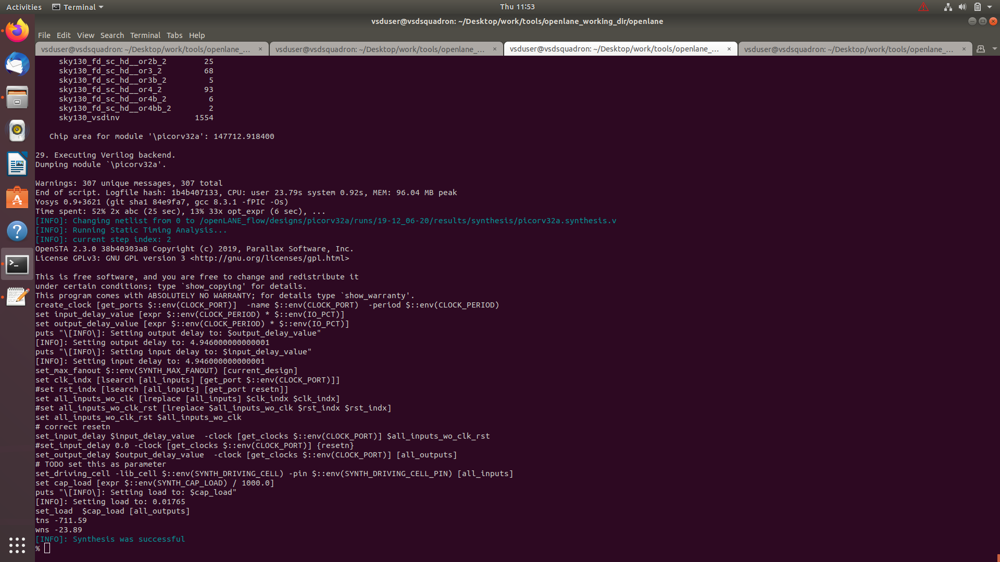
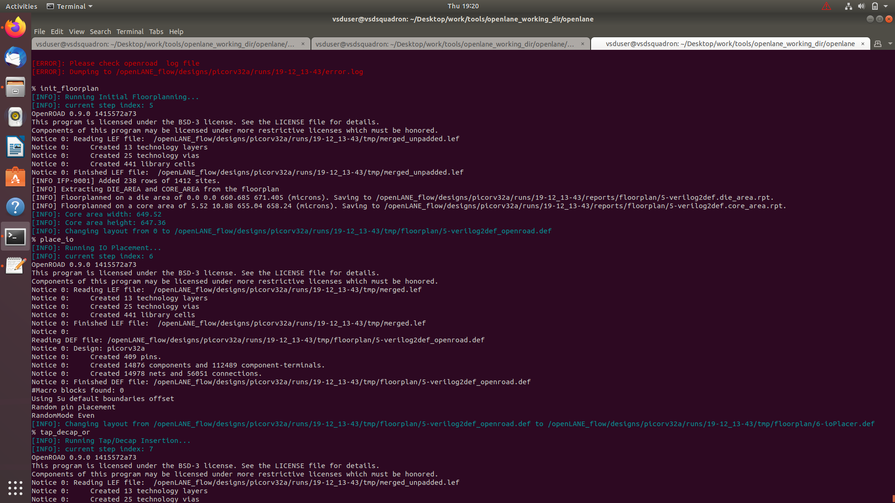
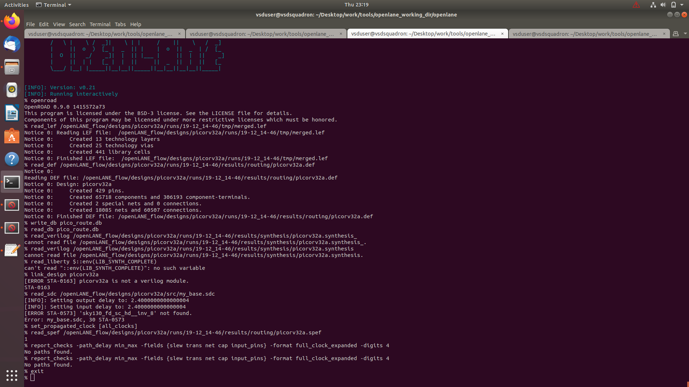

# Digital VLSI SoC Design and Planning


<!---
Comments
-->

> 2 Week digital VLSI SoC design and planning workshop with complete RTL2GDSII flow organised by VSD in collaboration with NASSCOM

## Section 1 - Inception of open-source EDA, OpenLANE and Sky130 PDK

### Implementation

Section 1 tasks:- 
1. Run 'picorv32a' design synthesis using OpenLANE flow and generate necessary outputs.
2. Calculate the flop ratio.

```math
Flop\ Ratio = \frac{Number\ of\ D\ Flip\ Flops}{Total\ Number\ of\ Cells}
```
```math
Percentage\ of\ DFF's = Flop\ Ratio * 100
```

#### 1. Run 'picorv32a' design synthesis using OpenLANE flow and generate necessary outputs.

Commands to invoke the OpenLANE flow and perform synthesis

```bash
# Change directory to openlane flow directory
cd Desktop/work/tools/openlane_working_dir/openlane

docker
```
```tcl
# Now that we have entered the OpenLANE flow contained docker sub-system we can invoke the OpenLANE flow in the Interactive mode using the following command
./flow.tcl -interactive

# Now that OpenLANE flow is open we have to input the required packages for proper functionality of the OpenLANE flow
package require openlane 0.9

# Now the OpenLANE flow is ready to run any design and initially we have to prep the design creating some necessary files and directories for running a specific design which in our case is 'picorv32a'
prep -design picorv32a

# Now that the design is prepped and ready, we can run synthesis using following command
run_synthesis

# Exit from OpenLANE flow
exit

# Exit from OpenLANE flow docker sub-system
exit
```

Screenshots of running each commands


#### 2. Calculate the flop ratio.

Screenshots of synthesis statistics report file with required values highlighted


Calculation of Flop Ratio and DFF % from synthesis statistics report file

```math
Flop\ Ratio = \frac{1613}{14876} = 0.108429685
```
```math
Percentage\ of\ DFF's = 0.108429685 * 100 = 10.84296854\ \%
```

## Section 2 - Good floorplan vs bad floorplan and introduction to library cells

### Theory

### Implementation

Section 2 tasks:- 
1. Run 'picorv32a' design floorplan using OpenLANE flow and generate necessary outputs.
2. Calculate the die area in microns from the values in floorplan def.
3. Load generated floorplan def in magic tool and explore the floorplan.
4. Run 'picorv32a' design congestion aware placement using OpenLANE flow and generate necessary outputs.
5. Load generated placement def in magic tool and explore the placement.

```math
Area\ of\ die\ in\ microns = Die\ width\ in\ microns * Die\ height\ in\ microns
```

#### 1. Run 'picorv32a' design floorplan using OpenLANE flow and generate necessary outputs.

Commands to invoke the OpenLANE flow and perform floorplan

```bash
# Change directory to openlane flow directory
cd Desktop/work/tools/openlane_working_dir/openlane

# alias docker='docker run -it -v $(pwd):/openLANE_flow -v $PDK_ROOT:$PDK_ROOT -e PDK_ROOT=$PDK_ROOT -u $(id -u $USER):$(id -g $USER) efabless/openlane:v0.21'
# Since we have aliased the long command to 'docker' we can invoke the OpenLANE flow docker sub-system by just running this command
docker
```
```tcl
# Now that we have entered the OpenLANE flow contained docker sub-system we can invoke the OpenLANE flow in the Interactive mode using the following command
./flow.tcl -interactive

# Now that OpenLANE flow is open we have to input the required packages for proper functionality of the OpenLANE flow
package require openlane 0.9

# Now the OpenLANE flow is ready to run any design and initially we have to prep the design creating some necessary files and directories for running a specific design which in our case is 'picorv32a'
prep -design picorv32a

# Now that the design is prepped and ready, we can run synthesis using following command
run_synthesis

# Now we can run floorplan
run_floorplan
```

Screenshot of floorplan run


#### 2. Calculate the die area in microns from the values in floorplan def.

Screenshot of contents of floorplan def




According to floorplan def
```math
1000\ Unit\ Distance = 1\ Micron
```
```math
Die\ width\ in\ unit\ distance = 660685 - 0 = 660685
```
```math
Die\ height\ in\ unit\ distance = 671405 - 0 = 671405
```
```math
Distance\ in\ microns = \frac{Value\ in\ Unit\ Distance}{1000}
```
```math
Die\ width\ in\ microns = \frac{660685}{1000} = 660.685\ Microns
```
```math
Die\ height\ in\ microns = \frac{671405}{1000} = 671.405\ Microns
```
```math
Area\ of\ die\ in\ microns = 660.685 * 671.405 = 443587.212425\ Square\ Microns
```

#### 3. Load generated floorplan def in magic tool and explore the floorplan.

Commands to load floorplan def in magic in another terminal

```bash
# Change directory to path containing generated floorplan def
cd Desktop/work/tools/openlane_working_dir/openlane/designs/picorv32a/runs/17-03_12-06/results/floorplan/

# Command to load the floorplan def in magic tool
magic -T /home/vsduser/Desktop/work/tools/openlane_working_dir/pdks/sky130A/libs.tech/magic/sky130A.tech lef read ../../tmp/merged.lef def read picorv32a.floorplan.def &
```

Screenshots of floorplan def in magic


Equidistant placement of ports


Port layer as set through config.tcl


Decap Cells and Tap Cells


Diogonally equidistant Tap cells


Unplaced standard cells at the origin


#### 4. Run 'picorv32a' design congestion aware placement using OpenLANE flow and generate necessary outputs.

Command to run placement

```tcl
# Congestion aware placement by default
run_placement
```

Screenshots of placement run


#### 5. Load generated placement def in magic tool and explore the placement.

Commands to load placement def in magic in another terminal

```bash
# Change directory to path containing generated placement def
cd Desktop/work/tools/openlane_working_dir/openlane/designs/picorv32a/runs/17-03_12-06/results/placement/

# Command to load the placement def in magic tool
magic -T /home/vsduser/Desktop/work/tools/openlane_working_dir/pdks/sky130A/libs.tech/magic/sky130A.tech lef read ../../tmp/merged.lef def read picorv32a.placement.def &
```

Screenshots of floorplan def in magic




Commands to exit from current run

```tcl
# Exit from OpenLANE flow
exit

# Exit from OpenLANE flow docker sub-system
exit
```

## Section 3 - Design library cell using Magic Layout and ngspice characterization

#### 1. Clone custom inverter standard cell design from github repository

```bash
# Change directory to openlane
cd Desktop/work/tools/openlane_working_dir/openlane

# Clone the repository with custom inverter design
git clone https://github.com/nickson-jose/vsdstdcelldesign

# Change into repository directory
cd vsdstdcelldesign

# Copy magic tech file to the repo directory for easy access
cp /home/vsduser/Desktop/work/tools/openlane_working_dir/pdks/sky130A/libs.tech/magic/sky130A.tech .

# Check contents whether everything is present
ls

# Command to open custom inverter layout in magic
magic -T sky130A.tech sky130_inv.mag &
```

Screenshot of commands run


#### 2. Load the custom inverter layout in magic and explore.

Screenshot of custom inverter layout in magic


NMOS and PMOS identified


Output Y connectivity to PMOS and NMOS drain verified


PMOS source connectivity to VDD (here VPWR) verified


NMOS source connectivity to VSS (here VGND) verified


#### 3. Spice extraction of inverter in magic.

Commands for spice extraction of the custom inverter layout to be used in tkcon window of magic

```tcl
# Check current directory
pwd

# Extraction command to extract to .ext format
extract all

# Before converting ext to spice this command enable the parasitic extraction also
ext2spice cthresh 0 rthresh 0

# Converting to ext to spice
ext2spice
```

Screenshot of tkcon window after running above commands


Screenshot of created spice file


#### 4. Editing the spice model file for analysis through simulation.

Measuring unit distance in layout grid


Final edited spice file ready for ngspice simulation



#### 5. Post-layout ngspice simulations.

Commands for ngspice simulation

```bash
# Command to directly load spice file for simulation to ngspice
ngspice sky130_inv.spice

# Now that we have entered ngspice with the simulation spice file loaded we just have to load the plot
plot y vs time a
```

Screenshots of ngspice run


Screenshot of generated plot


Rise transition time calculation

```math
Rise\ transition\ time = Time\ taken\ for\ output\ to\ rise\ to\ 80\% - Time\ taken\ for\ output\ to\ rise\ to\ 20\%
```
```math
20\%\ of\ output = 660\ mV
```
```math
80\%\ of\ output = 2.64\ V
```

Fall transition time calculation

```math
Fall\ transition\ time = Time\ taken\ for\ output\ to\ fall\ to\ 20\% - Time\ taken\ for\ output\ to\ fall\ to\ 80\%
```
```math
20\%\ of\ output = 660\ mV
```
```math
80\%\ of\ output = 2.64\ V
```

20% Screenshots




80% Screenshots


```math
Rise\ transition\ time = 2.24638 - 2.18242 = 0.06396\ ns = 63.96\ ps
```
```math
Fall\ transition\ time = 4.0955 - 4.0536 = 0.0419\ ns = 41.9\ ps
```

#### 6. Find problem in the DRC section of the old magic tech file for the skywater process and fix them.

Link to Sky130 Periphery rules: [https://skywater-pdk.readthedocs.io/en/main/rules/periphery.html](https://skywater-pdk.readthedocs.io/en/main/rules/periphery.html)

Commands to download and view the corrupted skywater process magic tech file and associated files to perform drc corrections

```bash
# Change to home directory
cd

# Command to download the lab files
wget http://opencircuitdesign.com/open_pdks/archive/drc_tests.tgz

# Since lab file is compressed command to extract it
tar xfz drc_tests.tgz

# Change directory into the lab folder
cd drc_tests

# List all files and directories present in the current directory
ls -al

# Command to view .magicrc file
gvim .magicrc

# Command to open magic tool in better graphics
magic -d XR &
```

Screenshots of commands run


Screenshot of .magicrc file


**Incorrectly implemented poly.9 simple rule correction**

Screenshot of poly rules


Incorrectly implemented poly.9 rule no drc violation even though spacing < 0.48u


New commands inserted in sky130A.tech file to update drc


Commands to run in tkcon window

```tcl
# Loading updated tech file
tech load sky130A.tech

# Must re-run drc check to see updated drc errors
drc check

# Selecting region displaying the new errors and getting the error messages 
drc why
```

Screenshot of magic window with rule implemented


**Incorrectly implemented nwell.4 complex rule correction**

Incorrectly implemented nwell.4 rule no drc violation even though no tap present in nwell


New commands inserted in sky130A.tech file to update drc


Commands to run in tkcon window

```tcl
# Loading updated tech file
tech load sky130A.tech

# Change drc style to drc full
drc style drc(full)

# Must re-run drc check to see updated drc errors
drc check

# Selecting region displaying the new errors and getting the error messages 
drc why
```

Screenshot of magic window with rule implemented


## Section 4 - Pre-layout timing analysis and importance of good clock tree

#### Fix up small DRC errors and verify the design is ready to be inserted into our flow.

Conditions to be verified before moving forward with custom designed cell layout:
* Condition 1: The input and output ports of the standard cell should lie on the intersection of the vertical and horizontal tracks.
* Condition 2: Width of the standard cell should be odd multiples of the horizontal track pitch.
* Condition 3: Height of the standard cell should be even multiples of the vertical track pitch.

Commands to open the custom inverter layout

```bash
# Change directory to vsdstdcelldesign
cd Desktop/work/tools/openlane_working_dir/openlane/vsdstdcelldesign

# Command to open custom inverter layout in magic
magic -T sky130A.tech sky130_inv.mag &
```

Screenshot of tracks.info of sky130_fd_sc_hd


Commands for tkcon window to set grid as tracks of locali layer

```tcl
# Get syntax for grid command
help grid

# Set grid values accordingly
grid 0.46um 0.34um 0.23um 0.17um
```

Screenshot of commands run


#### Save the finalized layout with custom name and open it.

Command for tkcon window to save the layout with custom name

```tcl
# Command to save as
save sky130_vsdinv.mag
```

Command to open the newly saved layout

```bash
# Command to open custom inverter layout in magic
magic -T sky130A.tech sky130_vsdinv.mag &
```

Screenshot of newly saved layout


#### Generate lef from the layout.

Command for tkcon window to write lef

```tcl
# lef command
lef write
```

Screenshot of command run


Screenshot of newly created lef file


#### Copy the newly generated lef and associated required lib files to 'picorv32a' design 'src' directory.

Commands to copy necessary files to 'picorv32a' design 'src' directory

```bash
# Copy lef file
cp sky130_vsdinv.lef ~/Desktop/work/tools/openlane_working_dir/openlane/designs/picorv32a/src/

# List and check whether it's copied
ls ~/Desktop/work/tools/openlane_working_dir/openlane/designs/picorv32a/src/

# Copy lib files
cp libs/sky130_fd_sc_hd__* ~/Desktop/work/tools/openlane_working_dir/openlane/designs/picorv32a/src/

# List and check whether it's copied
ls ~/Desktop/work/tools/openlane_working_dir/openlane/designs/picorv32a/src/
```

Screenshot of commands run


#### Edit 'config.tcl' to change lib file and add the new extra lef into the openlane flow.

Commands to be added to config.tcl to include our custom cell in the openlane flow

```tcl
set ::env(LIB_SYNTH) "$::env(OPENLANE_ROOT)/designs/picorv32a/src/sky130_fd_sc_hd__typical.lib"
set ::env(LIB_FASTEST) "$::env(OPENLANE_ROOT)/designs/picorv32a/src/sky130_fd_sc_hd__fast.lib"
set ::env(LIB_SLOWEST) "$::env(OPENLANE_ROOT)/designs/picorv32a/src/sky130_fd_sc_hd__slow.lib"
set ::env(LIB_TYPICAL) "$::env(OPENLANE_ROOT)/designs/picorv32a/src/sky130_fd_sc_hd__typical.lib"

set ::env(EXTRA_LEFS) [glob $::env(OPENLANE_ROOT)/designs/$::env(DESIGN_NAME)/src/*.lef]
```

Edited config.tcl to include the added lef and change library to ones we added in src directory












## Section 5 - Final steps for RTL2GDS using tritonRoute and openSTA

#### 1. Perform generation of Power Distribution Network (PDN) and explore the PDN layout.

Commands to perform all necessary stages up until now

```bash
# Change directory to openlane flow directory
cd Desktop/work/tools/openlane_working_dir/openlane

# alias docker='docker run -it -v $(pwd):/openLANE_flow -v $PDK_ROOT:$PDK_ROOT -e PDK_ROOT=$PDK_ROOT -u $(id -u $USER):$(id -g $USER) efabless/openlane:v0.21'
# Since we have aliased the long command to 'docker' we can invoke the OpenLANE flow docker sub-system by just running this command
docker
```
```tcl
# Now that we have entered the OpenLANE flow contained docker sub-system we can invoke the OpenLANE flow in the Interactive mode using the following command
./flow.tcl -interactive

# Now that OpenLANE flow is open we have to input the required packages for proper functionality of the OpenLANE flow
package require openlane 0.9

# Now the OpenLANE flow is ready to run any design and initially we have to prep the design creating some necessary files and directories for running a specific design which in our case is 'picorv32a'
prep -design picorv32a

# Addiitional commands to include newly added lef to openlane flow merged.lef
set lefs [glob $::env(DESIGN_DIR)/src/*.lef]
add_lefs -src $lefs

# Command to set new value for SYNTH_STRATEGY
set ::env(SYNTH_STRATEGY) "DELAY 3"

# Command to set new value for SYNTH_SIZING
set ::env(SYNTH_SIZING) 1

# Now that the design is prepped and ready, we can run synthesis using following command
run_synthesis

# Following commands are alltogather sourced in "run_floorplan" command
init_floorplan
place_io
tap_decap_or

# Now we are ready to run placement
run_placement

# Incase getting error
unset ::env(LIB_CTS)

# With placement done we are now ready to run CTS
run_cts

# Now that CTS is done we can do power distribution network
gen_pdn 
```

Screenshots of power distribution network run


Commands to load PDN def in magic in another terminal

```bash
# Change directory to path containing generated PDN def
cd Desktop/work/tools/openlane_working_dir/openlane/designs/picorv32a/runs/19-12_14-46/tmp/floorplan/

# Command to load the PDN def in magic tool
magic -T /home/vsduser/Desktop/work/tools/openlane_working_dir/pdks/sky130A/libs.tech/magic/sky130A.tech lef read ../../tmp/merged.lef def read 14-pdn.def &
```

Screenshots of PDN def


#### 2. Perfrom detailed routing using TritonRoute and explore the routed layout.

Command to perform routing

```tcl
# Check value of 'CURRENT_DEF'
echo $::env(CURRENT_DEF)

# Check value of 'ROUTING_STRATEGY'
echo $::env(ROUTING_STRATEGY)

# Command for detailed route using TritonRoute
run_routing
```

Screenshots of routing run


Commands to load routed def in magic in another terminal

```bash
# Change directory to path containing routed def
cd Desktop/work/tools/openlane_working_dir/openlane/designs/picorv32a/runs/19-12_14-46/results/routing/

# Command to load the routed def in magic tool
magic -T /home/vsduser/Desktop/work/tools/openlane_working_dir/pdks/sky130A/libs.tech/magic/sky130A.tech lef read ../../tmp/merged.lef def read picorv32a.def &
```

Screenshots of routed def


Screenshot of fast route guide present in `openlane/designs/picorv32a/runs/19-12_14-46/tmp/routing` directory


#### 3. Post-Route parasitic extraction using SPEF extractor.

Commands for SPEF extraction using external tool

```bash
# Change directory
cd Desktop/work/tools/SPEF_EXTRACTOR

# Command extract spef
python3 main.py /home/vsduser/Desktop/work/tools/openlane_working_dir/openlane/designs/picorv32a/runs/19-12_14-46/tmp/merged.lef /home/vsduser/Desktop/work/tools/openlane_working_dir/openlane/designs/picorv32a/runs/19-12_14-46/results/routing/picorv32a.def
```

#### 4. Post-Route OpenSTA timing analysis with the extracted parasitics of the route.

Commands to be run in OpenLANE flow to do OpenROAD timing analysis with integrated OpenSTA in OpenROAD

```tcl
# Command to run OpenROAD tool
openroad

# Reading lef file
read_lef /openLANE_flow/designs/picorv32a/runs/19-12_14-46/tmp/merged.lef

# Reading def file
read_def /openLANE_flow/designs/picorv32a/runs/19-12_14-46/results/routing/picorv32a.def

# Creating an OpenROAD database to work with
write_db pico_route.db

# Loading the created database in OpenROAD
read_db pico_route.db

# Read netlist post CTS
read_verilog /openLANE_flow/designs/picorv32a/runs/19-12_14-46/results/synthesis/picorv32a.synthesis_preroute.v

# Read library for design
read_liberty $::env(LIB_SYNTH_COMPLETE)

# Link design and library
link_design picorv32a

# Read in the custom sdc we created
read_sdc /openLANE_flow/designs/picorv32a/src/my_base.sdc

# Setting all cloks as propagated clocks
set_propagated_clock [all_clocks]

# Read SPEF
read_spef /openLANE_flow/designs/picorv32a/runs/19-12_14-46/results/routing/picorv32a.spef

# Generating custom timing report
report_checks -path_delay min_max -fields {slew trans net cap input_pins} -format full_clock_expanded -digits 4

# Exit to OpenLANE flow
exit
```

Screenshots of commands run and timing report generated



# Acknowledgements

* [Kunal Ghosh](https://github.com/kunalg123), Co-founder, VSD Corp. Pvt. Ltd.
* [Nickson P Jose](https://github.com/nickson-jose), Physical Design Engineer, Intel Corporation.
* [R. Timothy Edwards](https://github.com/RTimothyEdwards), Senior Vice President of Analog and Design, efabless 
